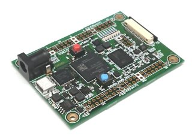

# FX2Writer説明書
2021年1月30日作成  
(C)Copyright 特殊電子回路株式会社

## 概要
このソフトウェアは、EEPROMがブランク状態のEZ-USB FX2にファームウェアを書き込むためのものです。

動作テストは特電Spartan-7ボードと専用ファームウェアで行っていますが、EZ-USB FX2(LP)が搭載されたボードであればどのようなファームウェアでも書き込み可能です。

動作環境はWindows 8.1、Windows 10(x64)です。

## 説明

EZ-USB FX2は、EEPROMが接続されていない状態か、EEPROMの内容が空であるとき、  
VID=0x04b4 PID=0x8613のデバイスとして認識され、cyusb3というデバイスドライバが組み込まれます。

この状態で起動したEZ-USBに対して、**EEPROMあるいは内蔵RAMにファームウェアを転送**します。

RAMに転送した場合はすぐに再起動され新しいファームウェアで動作します。  
ROMに転送した場合は、USBデバイスを再起動(通常は電源OFF/ON)で新しいファームウェアで動作します。

---
## 使い方
1. EEPROM Missing状態のFX2デバイスとPCをUSBで接続します。

2. FX2Writer.exe 起動します。  

3. テキストボックスに書き込みたいファームウェアのファイル名を指定します。

> firmwareフォルダには[特電Spartan-6ボード](http://www.tokudenkairo.co.jp/sp6/)のためのファームウェアファイルnp1027.iicと、  
[特電Spartan-7ボード](http://www.tokudenkairo.co.jp/sp7/)のためのファームウェアファイルnp1116.iicが入っています。

4. RAMに書き込むか、EEPROMに書き込むかを選択します。
5. Programボタンを押します。
6. Successと表示されれば成功です。
7. Failedと表示された場合は、EEPROMへのジャンパで切断されていないか、EEPROMが正しく実装されているかを確認してください。

---
## FX2LP EEPROM Missingのデバイスドライバが見つからない場合
FX2LP EEPROM Missingデバイス(04b4:8163)用のデバイスドライバが見つからない場合は、  
cyusb-driveri-win8.1-x64 フォルダを参照してください。
この中のdpinst.exeを実行すると自動的にインストールされます。

これはWindows8.1 x64用のドライバですが、Windows 10でも使用できます。  
上記以外のOS版が必要な場合はCypressのEZ-USB FX2LP開発キットを参照してください。

## 消去する方法
FX2LPが新しいファームウェアで起動すると、  
VIDとPIDが変更されて独自の専用デバイスドライバで動作するため、cyusbは使用できなくなります。

特殊電子回路株式会社のSpartan-6ボード用はezusb.sysという古いタイプのCypress EZ-USB FX2ドライバで動作しており、  
このファームウェアとドライバ用に[SP6FirmEraser](https://github.com/tokuden/SP6FirmEraser)というソフトウェアを用意しています。消去はEraserを使用してください。

## RAMとROMの使い分け
RAMに書き込んだファームウェアは電源をOFFにすると消去されるので、ファームウェア自体を開発する場合のテストに向いています。  
ROMに書き込んだファームウェアは電源OFFでも消えないので、ある程度ファームウェアの開発が進んだ段階や、製品リリースの際に使います。

## 応用
ソースコードを公開しているので、自由に拡張してください。  
書き込みのたびにシリアル番号を変更したり、書き込みのログを取るような改良を加えると製品管理に役だつかもしれません。

## ライセンス
アプリの利用はもちろん、ソースコードの参照など利用者の責任の範囲で自由に使用して構いません。

---
## 動作確認基板
**特電Spartan-7ボード**  
XC7S50-*CSG324Cを中心に512MByteのDDR3 SDRAM、MIPI-CSIコネクタ、EZ-USB FX2、100Mbps Etherを搭載し、  
2.54mmピッチのピンヘッダで容易に拡張できる使いやすいFPGAボード

[特電Spartan-7ボード](http://www.tokudenkairo.co.jp/sp7/) はこちら

